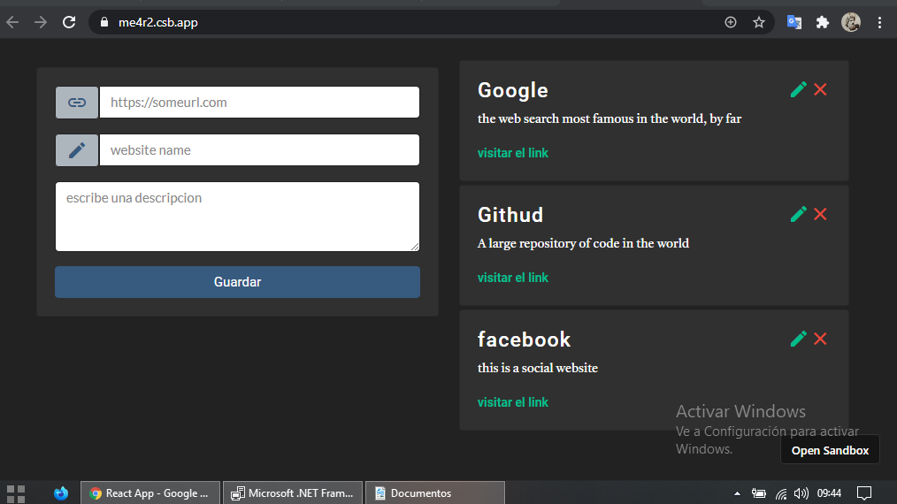

# firebase-react-crud-link

este es un proyecto completo realizado en react, como pratica de los aprendido en un curso de react con fazt, usando hooks, materialize,bootstrap,toast-react etc..

tambien aprendiendo a usar props y el manejo de estados anidados

Created with CodeSandbox
